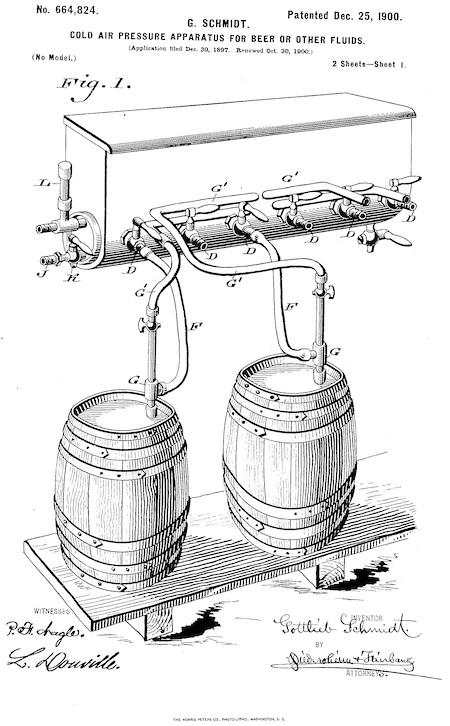

# Taproom

A repository of host-guest complexes available for benchmarking force fields used in the 
[OpenFF-Evaluator](https://github.com/openforcefield/openff-evaluator) program.



## Host-Guest Complexes
Taproom includes the following host-guest complexes (126 in total) with YAML files containing information necessary to perform free energy calculation using the attach-pull-release (APR) method.

* [`alpha-cyclodextrin`](taproom/systems/acd):
    * host key = `acd`
    * Data set from [Rekharsky et al.](https://pubs.acs.org/doi/abs/10.1021/jp962715n) - 22 host-guest complexes
* [`beta-cyclodextrin`](taproom/systems/bcd):
    * host key = `bcd`
    * Data set from [Rekharsky et al.](https://pubs.acs.org/doi/abs/10.1021/jp962715n) - 21 host-guest complexes
    * bCD--R-rimantadine from [SAMPL7](https://github.com/samplchallenges/SAMPL7/tree/master/host_guest/cyclodextrin_derivatives)
* [`cucurbit[7]uril`](taproom/systems/cb7):
    * host key = `cb7`
    * [SAMPL3](https://link.springer.com/article/10.1007/s10822-012-9554-1) - 2 host-guest complexes  (G8 and G9) 
    * [SAMPL4](https://pubmed.ncbi.nlm.nih.gov/24599514/) - 14 host-guest complexes
    * A1, A2, A5, B2, B5, B11 from [Moghaddam et al.](https://pubs.acs.org/doi/abs/10.1021/ja109904u)
    * 1 host-guest complex from [Kim et al.](https://www.pnas.org/doi/full/10.1073/pnas.062656699)
* [`cucurbit[8]uril`](taproom/systems/cb8):
    * host key = `cb8`
    * [SAMPL3](https://link.springer.com/article/10.1007/s10822-012-9554-1) - 2 host-guest complexes  (G8 and G9) 
    * [SAMPL6](https://github.com/samplchallenges/SAMPL6/tree/master/host_guest/CB8AndGuests) - 13 host-guest complexes (excluding G13)
    * [SAMPL8](https://github.com/samplchallenges/SAMPL8/tree/master/host_guest/CB8) - 7 host-guest complexes
* [`octa-acid`](taproom/systems/oah):
    * host key = `oah`
    * [SAMPL4](https://pubmed.ncbi.nlm.nih.gov/24599514/) - 9 host-guest complexes
    * [SAMPL5](https://link.springer.com/article/10.1007/s10822-016-9974-4) - 6 host-guest complexes
    * [SAMPL6](https://github.com/samplchallenges/SAMPL6/tree/master/host_guest/OctaAcidsAndGuests) - 8 host-guest complexes
* [`tetra-endo-methyl octa-acid`](taproom/systems/oam):
    * host key = `oam`
    * [SAMPL5](https://link.springer.com/article/10.1007/s10822-016-9974-4) - 6 host-guest complexes
    * [SAMPL6](https://github.com/samplchallenges/SAMPL6/tree/master/host_guest/OctaAcidsAndGuests) - 8 host-guest complexes

## Installation

This module is designed to be lightweight and have minimal dependencies. As such, the simplest way to use these benchmarks is to clone this repository and run `python setup.py develop`. After installation, `taproom.benchmarks` is exposed as an entry point, and available to other Python modules. The dictionary `host_guest_systems` contains YAML-formatted "instructions" that can be used to simulate the host-guest complexes. The dictionary `host_guest_measurements` contains YAML-formatted experimental data, curated from public literature.

The following snippet can be used to expose the installed benchmarks.

```python
import importlib.metadata

def _get_installed_benchmarks():
    _installed_benchmarks = {}

    for entry_point in importlib.metadata.entry_points(group="taproom.benchmarks"):
        _installed_benchmarks[entry_point.name] = entry_point.load()

    return _installed_benchmarks

host_guest_benchmarks = _get_installed_benchmarks()
host_guest_systems = host_guest_benchmarks["host_guest_systems"]
host_guest_measurements = host_guest_benchmarks["host_guest_measurements"]
```


## Schema

For information on the YAML formatting, see [`Schema.md`](docs/Schema.md).

## License

MIT. See [License](LICENSE) for more information.

## Copyright

Copyright (c) 2023, Open Force Field Consortium


## Contributors

- David R. Slochower
- Simon Boothroyd
- Katy Kellett
- Jeffry Setiadi
