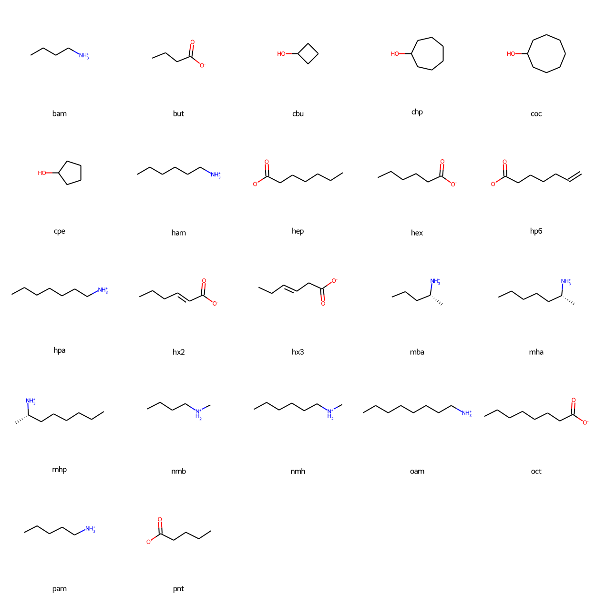

# alpha-cyclodextrin

* [bam](bam) - 1-butylamine (`CCCC[NH3+]`)
* [but](but) - butanoate (`CCCC(=O)[O-]`)
* [cbu](cbu) - cyclobutanol (`C1CC(C1)O`)
* [chp](chp) - cycloheptanol (`C1CCCC(CC1)O`)
* [coc](coc) - cyclooctanol (`C1CCCC(CCC1)O`)
* [cpe](cpe) - cyclopentanol (`C1CCC(C1)O`)
* [ham](ham) - 1-hyexylamine (`CCCCCC[NH3+]`)
* [hep](hep) - heptanoate (`CCCCCCC(=O)[O-]`)
* [hex](hex) - hexanoate (`CCCCCC(=O)[O-]`)
* [hp6](hp6) - 6-heptenoate (`C=CCCCCC(=O)[O-]`)
* [hpa](hpa) - 1-heptylamine (`CCCCCCC[NH3+]`)
* [hx2](hx2) - trans-2-hexenoate (`CCC/C=C/C(=O)[O-]`)
* [hx3](hx3) - trans-3-hexenoate (`CC/C=C/CC(=O)[O-]`)
* [mba](mba) - 1-methylbutylamine (`CCC[C@@H](C)[NH3+]`)
* [mha](mha) - 1-methylhexylamine (`CCCCC[C@@H](C)[NH3+]`)
* [mhp](mhp) - 1-methylheptylamine (`CCCCCC[C@H](C)[NH3+]`)
* [nmb](nmb) - n-methylbutylamine (`CCCC[NH2+]C`)
* [nmh](nmh) - n-methylhexylamine (`CCCCCC[NH2+]C`)
* [oam](oam) - 1-octylamine (`CCCCCCCC[NH3+]`)
* [oct](oct) - octanoate (`CCCCCCCC(=O)[O-]`)
* [pam](pam) - 1-pentylamine (`CCCCC[NH3+]`)
* [pnt](pnt) - pentanoate (`CCCCC(=O)[O-]`)

