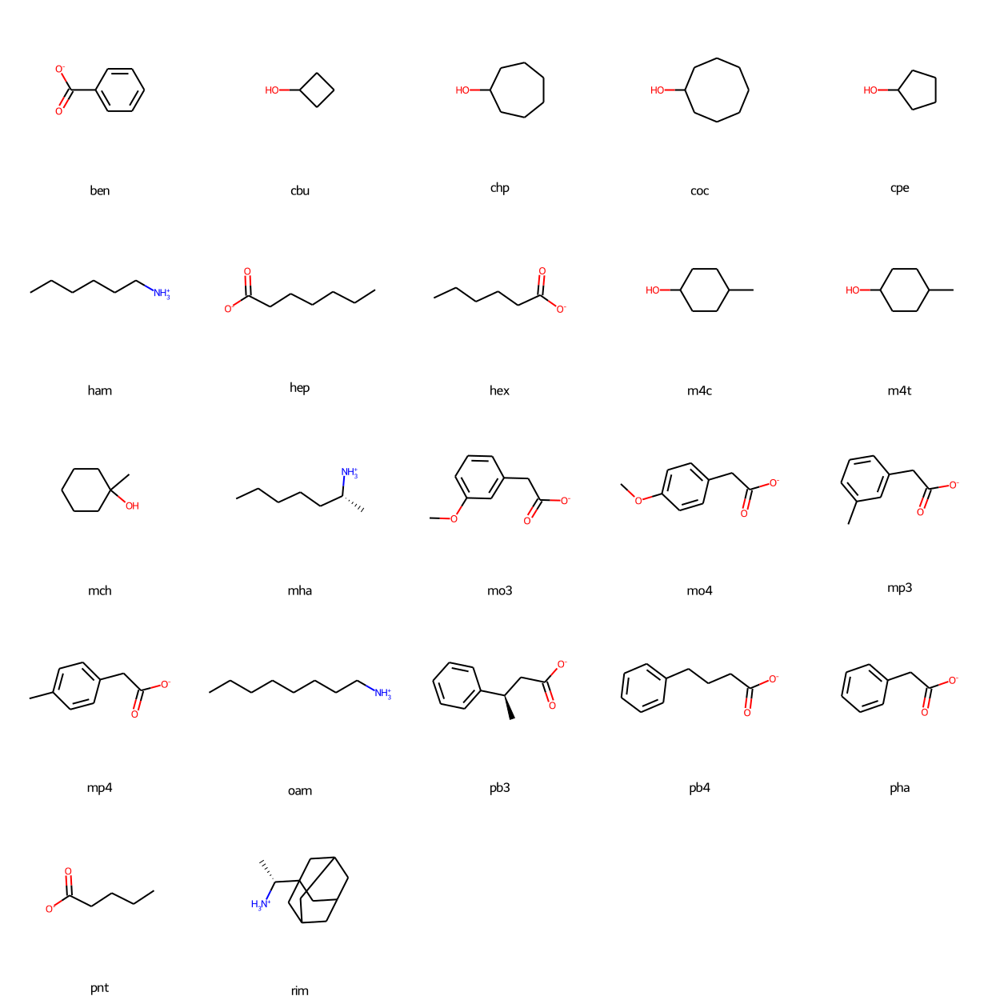

# beta-cyclodextrin

* [ben](ben) - benzoate (`c1ccc(cc1)C(=O)[O-]`)
* [cbu](cbu) - cyclobutanol (`C1CC(C1)O`)
* [chp](chp) - cycloheptanol (`C1CCCC(CC1)O`)
* [coc](coc) - cyclooctanol (`C1CCCC(CCC1)O`)
* [cpe](cpe) - cyclopentanol (`C1CCC(C1)O`)
* [ham](ham) - 1-hexylamine (`CCCCCC[NH3+]`)
* [hep](hep) - heptanoate (`CCCCCCC(=O)[O-]`)
* [hex](hex) - hexanoate (`CCCCCC(=O)[O-]`)
* [m4c](m4c) - cis-4-methylcyclohexanol (`CC1CCC(CC1)O`)
* [m4t](m4t) - trans-4-methylcyclohexanol (`CC1CCC(CC1)O`)
* [mch](mch) - 1-methylcyclohexanol (`CC1(CCCCC1)O`)
* [mha](mha) - 1-methylhexylamine (`CCCCC[C@@H](C)[NH3+]`)
* [mo3](mo3) - 3-methoxyphenylacetate (`COc1cccc(c1)CC(=O)[O-]`)
* [mo4](mo4) - 4-methoxyphenylacetate (`COc1ccc(cc1)CC(=O)[O-]`)
* [mp3](mp3) - 3-methylphenylacetate (`Cc1cccc(c1)CC(=O)[O-]`)
* [mp4](mp4) - 4-methylphenylacetate (`Cc1ccc(cc1)CC(=O)[O-]`)
* [oam](oam) - 1-octylamine (`CCCCCCCC[NH3+]`)
* [pb3](pb3) - 3-phenylbutanoate (`C[C@H](CC(=O)[O-])c1ccccc1`)
* [pb4](pb4) - 4-phenylbutanoate (`c1ccc(cc1)CCCC(=O)[O-]`)
* [pha](pha) - phenylacetate (`c1ccc(cc1)CC(=O)[O-]`)
* [pnt](pnt) - pentanoate (`CCCCC(=O)[O-]`)
* [rim](rim) - R-rimantadine (`C[C@H](C12CC3CC(C1)CC(C3)C2)[NH3+]`)

