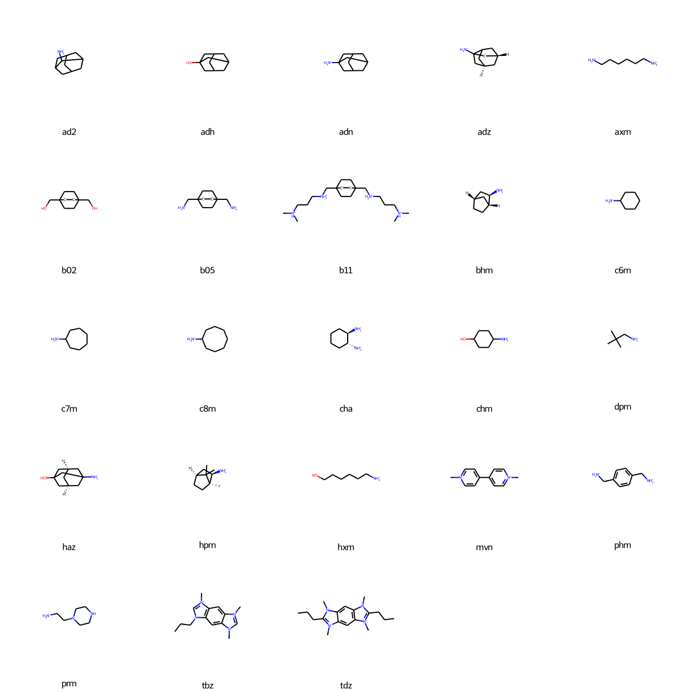

# Cucurbit[7]uril

* [ad2](ad2) - 2-adamantylamine (`C1C2CC3CC1CC(C2)C3[NH3+]`)
* [adh](adh) - 1-adamantanol (`C1C2CC3CC1CC(C2)(C3)O`)
* [adn](adn) - 1-adamantylamine (`C1C2CC3CC1CC(C2)(C3)[NH3+]`)
* [adz](adz) - 1-adamantylazanium (`C1[C@@H]2CC3C[C@H]1CC3(C2)[NH3+]`)
* [axm](axm) - 6-azaniumylhexylazanium (`C(CCC[NH3+])CC[NH3+]`)
* [b02](b02) - 1,4-bis(hydroxylmethyl)bicyclo[2.2.2]octane (`C1CC2(CCC1(CC2)CO)CO`)
* [b05](b05) - 1,4-bis(aminomethyl)bicyclo[2.2.2]octane (`C1CC2(CCC1(CC2)C[NH3+])C[NH3+]`)
* [b11](b11) - 1,4-bis(Me2NCH2CH2CH2NCH2)2bicyclo[2.2.2]octane (`C[NH+](C)CCC[NH2+]CC12CCC(CC1)(CC2)C[NH2+]CCC[NH+](C)C`)
* [bhm](bhm) - 2-bicyclo[2.2.1]heptanylazanium (`C1C[C@@H]2C[C@H]1C[C@H]2[NH3+]`)
* [c6m](c6m) - cyclohexylmethylazanium (`C1CCC(CC1)[NH3+]`)
* [c7m](c7m) - cycloheptylazanium (`C1CCCC(CC1)[NH3+]`)
* [c8m](c8m) - cyclooctylazanium (`C1CCCC(CCC1)[NH3+]`)
* [cha](cha) - ((1R,2R)-2-azaniumylcyclohexyl)azanium (`C1CC[C@H]([C@@H](C1)[NH3+])[NH3+]`)
* [chm](chm) - (4-hydroxycyclohexyl)azanium (`C1CC(CCC1[NH3+])O`)
* [dpm](dpm) - 2,2-dimethylpropylazanium (`CC(C)(C)C[NH3+]`)
* [haz](haz) - (3-hydroxy-1-adamantyl)azanium (`C1[C@@H]2CC3(C[C@H]1CC(C2)(C3)O)[NH3+]`)
* [hpm](hpm) - (1,7,7-trimethyl-2-bicyclo[2.2.1]heptanyl)azanium (`C[C@]12CC[C@H](C1(C)C)C[C@H]2[NH3+]`)
* [hxm](hxm) - 6-hydroxyhexylazanium (`C(CCCO)CC[NH3+]`)
* [mvn](mvn) - 1-methyl-4-(1-methylpyridin-1-ium-4-yl)pyridin-1-ium (`C[n+]1ccc(cc1)c2cc[n+](cc2)C`)
* [phm](phm) - (4-(azaniumylmethyl)phenyl)methylazanium (`c1cc(ccc1C[NH3+])C[NH3+]`)
* [prm](prm) - 2-piperazin-1-ylethylazanium (`C1CN(CCN1)CC[NH3+]`)
* [tbz](tbz) - 1,5,7-trimethyl-3-propylimidazo[4,5-f]benzimidazole-1,7-diium (`CCCN1C=[N+](c2c1cc3c(c2)[N+](=CN3C)C)C`)
* [tdz](tdz) - 1,3,5,7-tetramethyl-2,6-dipropylimidazo[4,5-f]benzimidazole-1,7-diium (`CCCC1=[N+](c2cc3c(cc2N1C)N(C(=[N+]3C)CCC)C)C`)

