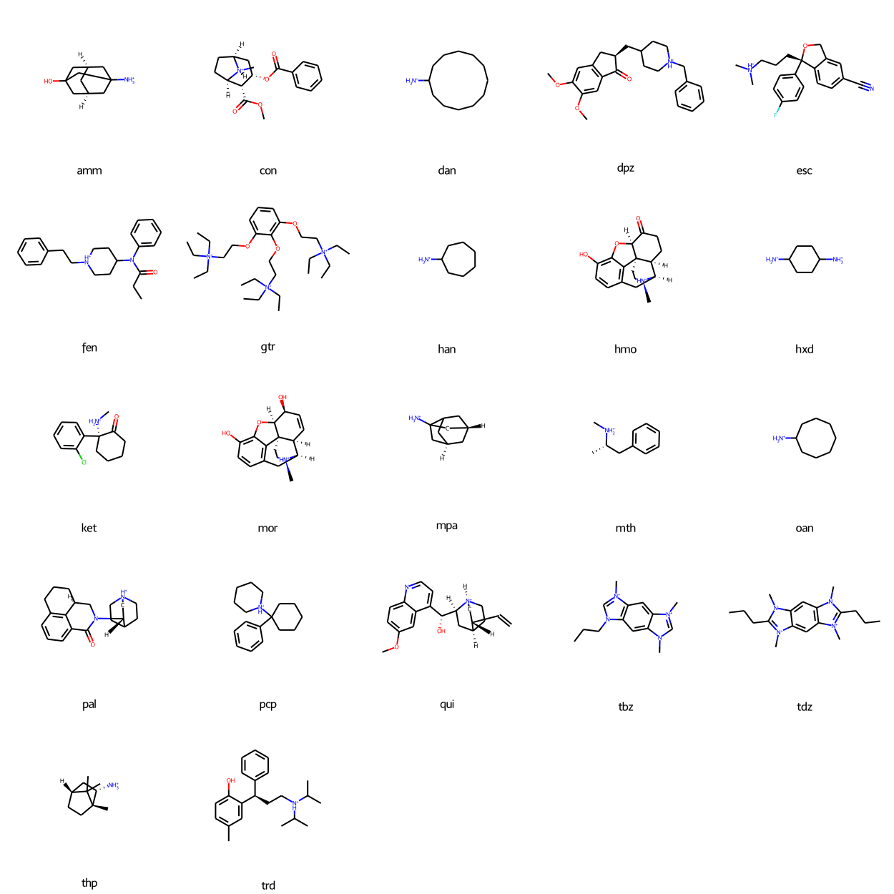

# Cucurbit[8]uril

* [amm](amm) - (1s,3r,5R,7S)-3-aminoadamantan-1-ol (`C1[C@@H]2CC3(C[C@H]1CC(C2)(C3)O)[NH3+]`)
* [con](con) - cocaine (`C[N@H+]1[C@H]2CC[C@@H]1[C@H]([C@H](C2)OC(=O)c3ccccc3)C(=O)OC`)
* [dan](dan) - cyclododecanamine (`C1CCCCCC(CCCCC1)[NH3+]`)
* [dpz](dpz) - donepezil (`COc1cc2c(cc1OC)C(=O)[C@@H](C2)CC3CC[NH+](CC3)Cc4ccccc4`)
* [esc](esc) - escitalopram (`C[NH+](C)CCC[C@@]1(c2ccc(cc2CO1)C#N)c3ccc(cc3)F`)
* [fen](fen) - fenthanyl (`CCC(=O)N(c1ccccc1)C2CC[NH+](CC2)CCc3ccccc3`)
* [gtr](gtr) - gallamine triethiodate (`CC[N+](CC)(CC)CCOc1cccc(c1OCC[N+](CC)(CC)CC)OCC[N+](CC)(CC)CC`)
* [han](han) - cycloheptanamine (`C1CCCC(CC1)[NH3+]`)
* [hmo](hmo) - hydromorphone (`C[N@H+]1CC[C@]23c4c5ccc(c4O[C@H]2C(=O)CC[C@H]3[C@H]1C5)O`)
* [hxd](hxd) - cyclohexane diamine (`C1CC(CCC1[NH3+])[NH3+]`)
* [ket](ket) - ketamine (`C[NH2+][C@]1(CCCCC1=O)c2ccccc2Cl`)
* [mor](mor) - morphine (`C[N@H+]1CC[C@]23c4c5ccc(c4O[C@H]2[C@H](C=C[C@H]3[C@H]1C5)O)O`)
* [mpa](mpa) - (2R,3as,5S,6as)-hexahydro-2,5-methanopentalen-3a(1H)-amine (`C1[C@@H]2CC3C[C@H]1CC3(C2)[NH3+]`)
* [mth](mth) - methamphetamine (`C[C@@H](Cc1ccccc1)[NH2+]C`)
* [oan](oan) - cyclooctanaine (`C1CCCC(CCC1)[NH3+]`)
* [pal](pal) - palonosetron (`c1cc2c3c(c1)C(=O)N(C[C@@H]3CCC2)[C@@H]4C[NH+]5CCC4CC5`)
* [pcp](pcp) - phenylcyclohexyl piperidine (`c1ccc(cc1)C2(CCCCC2)[NH+]3CCCCC3`)
* [qui](qui) - quinine (`COc1ccc2c(c1)c(ccn2)[C@H]([C@@H]3C[C@@H]4CC[N@H+]3C[C@@H]4C=C)O`)
* [tbz](tbz) - 1,5,7-trimethyl-3-propylimidazo[4,5-f]benzimidazole-1,7-diium (`CCCN1C=[N+](c2c1cc3c(c2)[N+](=CN3C)C)C`)
* [tdz](tdz) - 1,3,5,7-tetramethyl-2,6-dipropylimidazo[4,5-f]benzimidazole-1,7-diium (`CCCC1=[N+](c2cc3c(cc2N1C)N(C(=[N+]3C)CCC)C)C`)
* [thp](thp) - (1R,2S,4R)-1,7,7-trimethylbicyclo[2.2.1]heptan-2-amine) (`C[C@@]12CC[C@@H](C1(C)C)C[C@@H]2[NH3+]`)
* [trd](trd) - tolterodine (`Cc1ccc(c(c1)[C@H](CC[NH+](C(C)C)C(C)C)c2ccccc2)O`)

