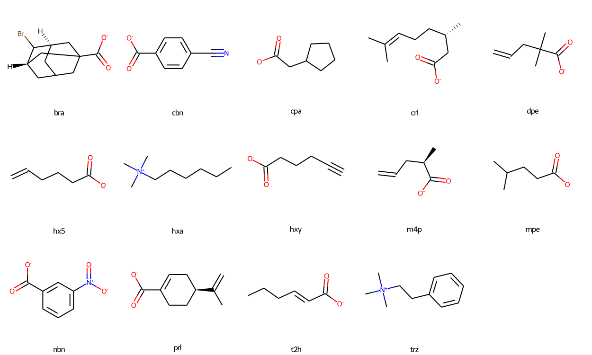

# tetra-endo-methyl octa-acid

* [bra](bra) - 4-Bromo-1-adamantanecarboxylic acid (`C1[C@@H]2CC3(C[C@@H](C2Br)CC1C3)C(=O)[O-]`)
* [cbn](cbn) - 4-cyanobenzoate (`c1cc(ccc1C#N)C(=O)[O-]`)
* [cpa](cpa) - cyclopentyl acetic acid (`C1CCC(C1)CC(=O)[O-]`)
* [crl](crl) - (s)-(-)-citronellic acid (`C[C@@H](CCC=C(C)C)CC(=O)[O-]`)
* [dpe](dpe) - 2,2-dimethly-4-pentenoic acid (`CC(C)(CC=C)C(=O)[O-]`)
* [hx5](hx5) - 5-hexenoic acid (`C=CCCCC(=O)[O-]`)
* [hxa](hxa) - hexyl(trimethyl)azanium (`CCCCCC[N+](C)(C)C`)
* [hxy](hxy) - 5-hexynoate (`C#CCCCC(=O)[O-]`)
* [m4p](m4p) - 2-methyly-4-pentenoic acid (`C[C@H](CC=C)C(=O)[O-]`)
* [mpe](mpe) - 4-methlypentenoic acid (`CC(C)CCC(=O)[O-]`)
* [nbn](nbn) - 3-nitrobenzoate (`c1cc(cc(c1)[N+](=O)[O-])C(=O)[O-]`)
* [prl](prl) - (s)-(-)-perillic acid (`CC(=C)[C@H]1CCC(=CC1)C(=O)[O-]`)
* [t2h](t2h) - trans-2-hexenoic acid (`CCC/C=C/C(=O)[O-]`)
* [trz](trz) - trimethyl(2-phenylethyl)azanium (`C[N+](C)(C)CCc1ccccc1`)

