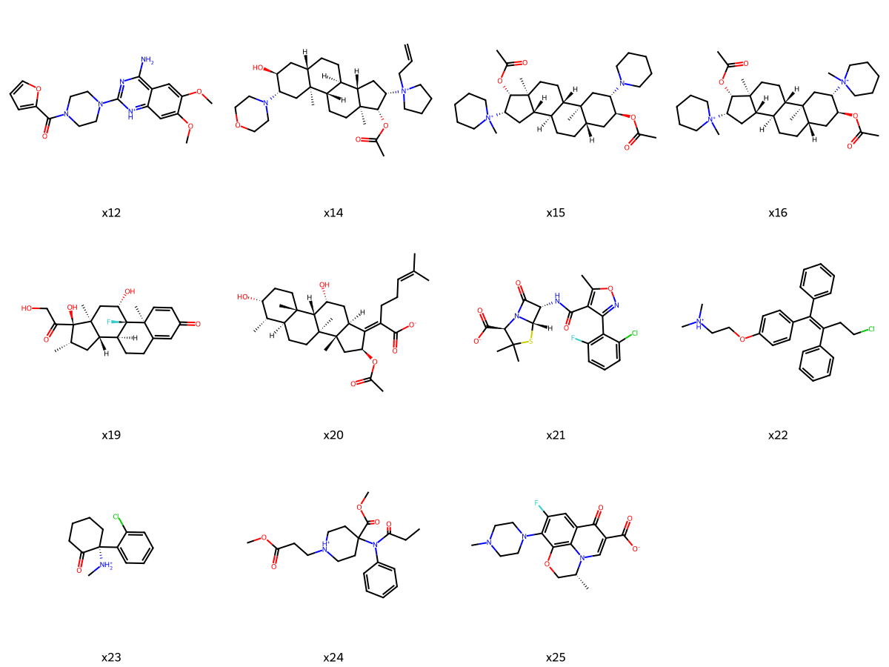

# Sugammadex

* [x12](x12) - prazosin (`COc1cc2c(cc1OC)nc(nc2N)N3CCN(CC3)C(=O)C4=CC=CO4`)
* [x14](x14) - rocuronium (`CC(=O)O[C@H]1[C@@H](C[C@@H]2[C@@]1(CC[C@H]3[C@@H]2CC[C@H]4[C@]3(C[C@@H]([C@H](C4)O)N5CCOCC5)C)C)[N+]6(CCCC6)CC=C`)
* [x15](x15) - vecuronium (`CC(=O)O[C@H]1C[C@@H]2CC[C@H]3[C@H]([C@@]2(C[C@H]1N4CCCCC4)C)CC[C@@]5([C@H]3C[C@H]([C@H]5OC(=O)C)[N+]6(CCCCC6)C)C`)
* [x16](x16) - pancuronium (`CC(=O)O[C@@H]1C[C@@H]2CC[C@@H]3[C@H]([C@@]2(C[C@H]1[N+]4(CCCCC4)C)C)CC[C@]5([C@@H]3C[C@H]([C@H]5OC(=O)C)[N+]6(CCCCC6)C)C`)
* [x17](x17) - atracurium (`C[N@@+]1(CCc2cc(c(cc2[C@@H]1Cc3ccc(c(c3)OC)OC)OC)OC)CCC(=O)OCCCCCOC(=O)CC[N@@+]4(CCc5cc(c(cc5[C@@H]4Cc6ccc(c(c6)OC)OC)OC)OC)C`)
* [x19](x19) - betamethasone (`C[C@H]1C[C@H]2[C@@H]3CCC4=CC(=O)C=C[C@@]4([C@]3([C@H](C[C@@]2([C@]1(C(=O)CO)O)C)O)F)C`)
* [x20](x20) - fusidic (`C[C@H]1[C@@H]2CC[C@@]3([C@H]([C@@]2(CC[C@@H]1O)C)[C@H](C[C@H]4[C@]3(C[C@H](C4=C(CCC=C(C)C)C(=O)O)OC(=O)C)C)O)C`)
* [x21](x21) - flucloxacillin (`CC1=C(C(=NO1)c2c(cccc2Cl)F)C(=O)N[C@@H]3[C@@H]4N(C3=O)[C@@H](C(S4)(C)C)C(=O)O`)
* [x22](x22) - toremifene (`CN(C)CCOc1ccc(cc1)C(=C(CCCl)c2ccccc2)c3ccccc3`)
* [x23](x23) - ketamine (`CN[C@]1(CCCCC1=O)c2ccccc2Cl`)
* [x24](x24) - remifentanil (`CCC(=O)N(c1ccccc1)C2(CCN(CC2)CCC(=O)OC)C(=O)OC`)
* [x25](x25) - levofloxacin (`C[C@@H]1COc2c3c(cc(c2N4CCN(CC4)C)F)C(=O)C(=CN31)C(=O)O`)

